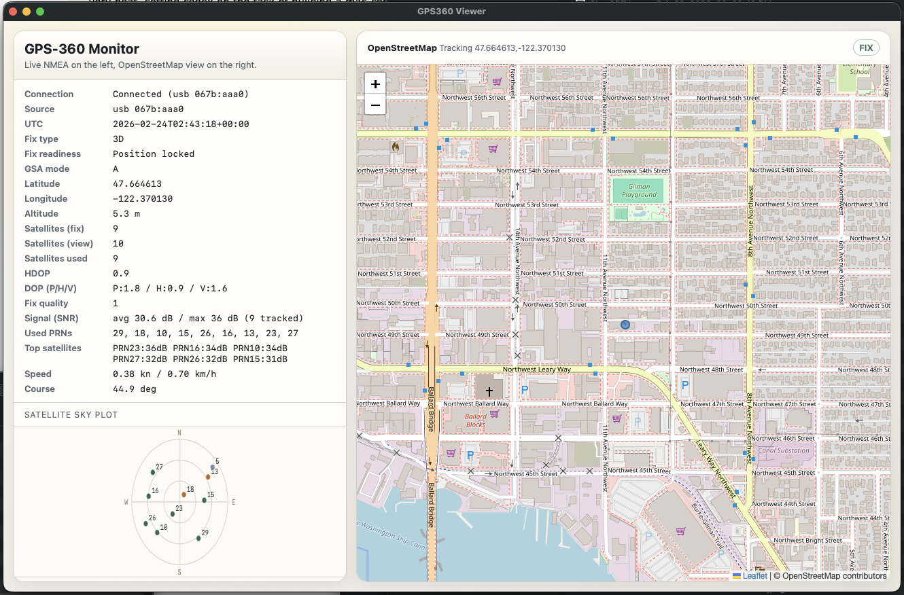
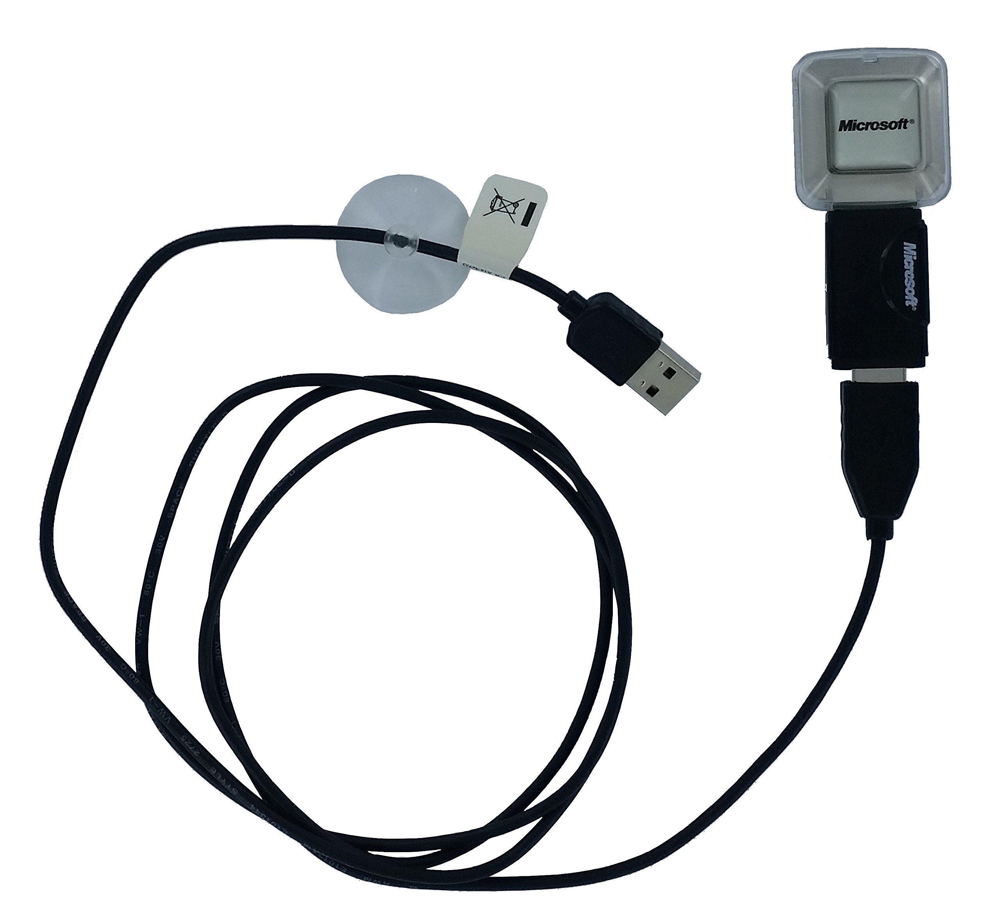
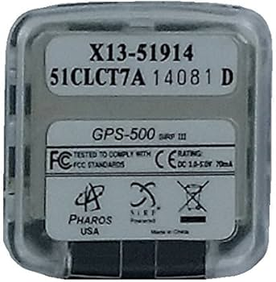

# Pharos Microsoft GPS-360 on Apple Silicon (M-series)

This project includes:
- A small user-space "driver" for the Pharos GPS-360 receiver (`gps360/driver.py`)
- A user-space Apple Silicon PL2303 USB driver (`gps360/pl2303.py`)
- A terminal app that reads live GPS fixes (`gps360/app.py`)
- A local GUI app (raw NMEA + OpenStreetMap) (`gps360/web_app.py`)
- A USB-to-PTY bridge command (`gps360/usb_bridge.py`)

It targets macOS on Apple Silicon and reads NMEA over a USB serial port (`/dev/cu.*`).
If no serial node is present, it can read directly from the Prolific USB device.

## Downloads

- App (Apple Silicon macOS): [gps360-viewer-macos-apple-silicon-v0.3.0.zip](https://github.com/lrehmann/gps360-viewer/releases/download/v0.3.0/gps360-viewer-macos-apple-silicon-v0.3.0.zip)
- App checksum: [gps360-viewer-macos-apple-silicon-v0.3.0.zip.sha256](https://github.com/lrehmann/gps360-viewer/releases/download/v0.3.0/gps360-viewer-macos-apple-silicon-v0.3.0.zip.sha256)
- Source bundle: [gps360-source-v0.3.0.zip](https://github.com/lrehmann/gps360-viewer/releases/download/v0.3.0/gps360-source-v0.3.0.zip)
- Source checksum: [gps360-source-v0.3.0.zip.sha256](https://github.com/lrehmann/gps360-viewer/releases/download/v0.3.0/gps360-source-v0.3.0.zip.sha256)
- Release page: [v0.3.0](https://github.com/lrehmann/gps360-viewer/releases/tag/v0.3.0)


*GPS360 Viewer on macOS.*

## Hardware variants and IDs

This codebase targets the same hardware family commonly sold/listed as:
- `PB010 iGPS-500`
- `Microsoft Pharos GPS-500`
- `PHAROS PB010 iGPS-500`

Common USB identity for these dongles:
- Vendor ID: `0x067B` (Prolific)
- Product ID: `0xAAA0`
- Typical USB product string: `USB-Serial Controller`

Quick hardware reference: [Pharos/Microsoft GPS-500 manual](https://manuals.plus/asin/B000GP0VH6)

Hardware photos (example unit):


*Front/device view.*


*Rear label view (example markings include `GPS-500` and `SiRF III`).*

## Compatibility and sharing

`GPS360 Viewer.app` can be shared with other Apple Silicon Macs (M1/M2/M3/M4) running macOS 13+.

Notes:
- The app bundle is relocatable and now embeds the `gps360` Python module.
- It is built as `arm64`; Intel Macs are not supported.
- Target machine needs Python 3 available at one of:
  - `/opt/homebrew/bin/python3`
  - `/usr/local/bin/python3`
  - `/usr/bin/python3`
- The app uses bundled `libusb` when available; otherwise install it with Homebrew (`brew install libusb`).
- OpenStreetMap tiles require internet access.
- The app is unsigned/not notarized by default.

If macOS says `"GPS360 Viewer" is damaged and can't be opened` after download:

1. Open **System Settings** -> **Privacy & Security**
2. Scroll to the Security section and click **Open Anyway** for `GPS360 Viewer`
3. Confirm by clicking **Open** in the follow-up dialog

If needed, fallback terminal method:

```bash
xattr -dr com.apple.quarantine "/path/to/GPS360 Viewer.app"
codesign --force --deep --sign - "/path/to/GPS360 Viewer.app"
open "/path/to/GPS360 Viewer.app"
```

To eliminate this for end users, sign with a Developer ID cert and notarize releases.

## Release packaging

Build and package publishable artifacts:

```bash
./scripts/package_release.sh 0.3.0
```

This generates:
- `dist/gps360-viewer-macos-apple-silicon-v0.3.0.zip`
- `dist/gps360-viewer-macos-apple-silicon-v0.3.0.zip.sha256`
- `dist/gps360-source-v0.3.0.zip`
- `dist/gps360-source-v0.3.0.zip.sha256`

## GUI quick start

Run commands from the project root (`Pharos Microsoft GPS-360 Receiver`), not from the inner `gps360/` folder.
If you are currently inside `gps360/`, either:
- run `cd ..` first, or
- prefix commands with `PYTHONPATH=..`

1. Build the Finder app:

```bash
./scripts/build_macos_app.sh
```

Then double-click `GPS360 Viewer.app`.
This opens a self-contained window (no terminal and no external browser window).

2. Or use the bundled wrapper launcher:

```bash
./launch_gps360_gui.command
```

This wrapper now just opens `GPS360 Viewer.app`.

3. Debug mode (web server + browser) if needed:

```bash
python3 -m gps360.web_app --transport usb --open-browser
```

If you change source files, re-run `./scripts/build_macos_app.sh`.

4. Stop the GUI server if needed:

```bash
pkill -f "python3 -m gps360.web_app" || true
```

The map panel pulls tiles from OpenStreetMap, so internet access is required for the right-side map.
The map uses an in-page renderer (Leaflet) to avoid iframe refresh flicker during live tracking.
`aibzy-1qsp1.icns` is used as the app icon when present (fallback: generated from `logo.png`).
The GUI now parses extra telemetry from `GSA`/`GSV`: fix type (No Fix/2D/3D), satellites in view, satellites used, DOP values, used PRNs, top SNR satellites, a fix-readiness indicator, and a live satellite sky-plot (azimuth/elevation).

## CLI quick start

Run commands from the project root (`Pharos Microsoft GPS-360 Receiver`), not from the inner `gps360/` folder.
If you are currently inside `gps360/`, either:
- run `cd ..` first, or
- prefix commands with `PYTHONPATH=..`

1. List candidate serial ports:

```bash
python3 -m gps360.app --list-ports
```

2. Run (defaults to direct USB transport):

```bash
python3 -m gps360.app
```

3. Or run with an explicit port:

```bash
python3 -m gps360.app --port /dev/cu.usbserial-XXXX
```

Use serial-first auto detect only when needed:

```bash
python3 -m gps360.app --transport auto
```

4. Optional: log fixes to JSON Lines:

```bash
python3 -m gps360.app --jsonl fixes.jsonl
```

5. Print raw NMEA sentences:

```bash
python3 -m gps360.app --raw
```

6. Create a virtual serial device from USB (PTY bridge):

```bash
python3 -m gps360.usb_bridge
```

Then use the printed `/dev/ttys*` path with serial tools or:

```bash
python3 -m gps360.app --port /dev/ttysXXXX
```

## Notes for the GPS-360 on M-series Macs

- This code is a user-space driver. It does not install a kernel extension.
- Auto-detection only accepts ports that emit valid NMEA, so it avoids unrelated serial devices.
- The receiver must still appear as a serial device under `/dev/cu.*`.
- Default mode is `--transport usb`, which uses a direct PL2303 user-space path via `libusb`.
- Use `--transport auto` for serial-first detection with USB fallback.
- Many GPS-360 units expose a USB-serial chipset (often PL2303 era hardware). If no serial port appears, you may need a macOS-compatible Apple Silicon USB-serial driver for that chipset.
- Some units boot in SiRF binary protocol; the USB-direct path sends a startup switch to NMEA automatically.

## Prerequisite for USB-direct mode

For CLI usage (`python3 -m gps360.app`) and source-only runs, `libusb` is required.
The packaged `GPS360 Viewer.app` bundles `libusb` when available at build time.
If your environment does not have `libusb`, install it:

```bash
brew install libusb
```

To inspect USB detection:

```bash
system_profiler SPUSBDataType | grep -Ei "pharos|prolific|pl2303|gps|serial" -B2 -A6
```

If the app reports:
- `Prolific USB hardware is attached, but no matching /dev/cu.* serial interface is available`

Then macOS sees the USB device, but does not have a usable serial endpoint for it yet. Default mode already uses USB-direct, so this is expected to still work.

## GitHub publish checklist

1. Run `./scripts/package_release.sh 0.3.0`
2. Push source files to GitHub (the `.gitignore` excludes app/capture/build artifacts)
3. Create a GitHub Release and upload:
   - `dist/gps360-viewer-macos-apple-silicon-v0.3.0.zip`
   - `dist/gps360-viewer-macos-apple-silicon-v0.3.0.zip.sha256`
   - `dist/gps360-source-v0.3.0.zip`
   - `dist/gps360-source-v0.3.0.zip.sha256`
4. In release notes, mention required Python 3 and optional Homebrew `libusb`

## Disclosure

This project was generated and refined with OpenAI Codex assistance.

## License

MIT, see `LICENSE`.

## NMEA support

The parser currently handles:
- `GGA` (position, fix quality, satellites, HDOP, altitude)
- `RMC` (status, position, speed, course, UTC date/time)

## App flags

```text
--port <path>       Explicit serial port (example: /dev/cu.usbserial-XXXX)
--baud <rate>       Baud rate (default: 4800)
--timeout <sec>     Read timeout per cycle (default: 2.0)
--list-ports        Print candidate serial ports and exit
--jsonl <file>      Append fixes as JSON lines
--once              Read and print one fix, then exit
--raw               Print raw NMEA sentences (good for connectivity checks)
--transport <mode>  `usb` (default), `auto`, or `serial`
--usb-vid <id>      USB vendor ID for direct mode (default: 0x067B)
--usb-pid <id>      USB product ID for direct mode (default: 0xAAA0)
```

## GUI flags

```text
--host <addr>       Bind host for local web app (default: 127.0.0.1)
--port <port>       Bind port for local web app (default: 8765)
--transport <mode>  `usb` (default), `auto`, or `serial`
--serial-port <p>   Explicit serial device for serial/auto mode
--baud <rate>       Baud rate (default: 4800)
--usb-vid <id>      USB vendor ID for direct mode (default: 0x067B)
--usb-pid <id>      USB product ID for direct mode (default: 0xAAA0)
--open-browser      Open GUI URL automatically
```

## Engineering Probe (SiRF Binary)

Use the engineering probe to test whether the receiver will switch into SiRF binary mode and to capture raw bytes:

```bash
python3 -m gps360.sirf_probe --duration 15
```

Outputs are saved under `captures/`:
- `sirf-<timestamp>.bin` raw bytes
- `sirf-<timestamp>.json` decoded summary

Interpretation:
- If `frame_count > 0`, the dongle emitted SiRF binary frames and the summary includes decoded MID data.
- If `frame_count == 0` and `wire_observation.likely_wire_protocol == "nmea_text"`, the device stayed in NMEA mode during probing.
